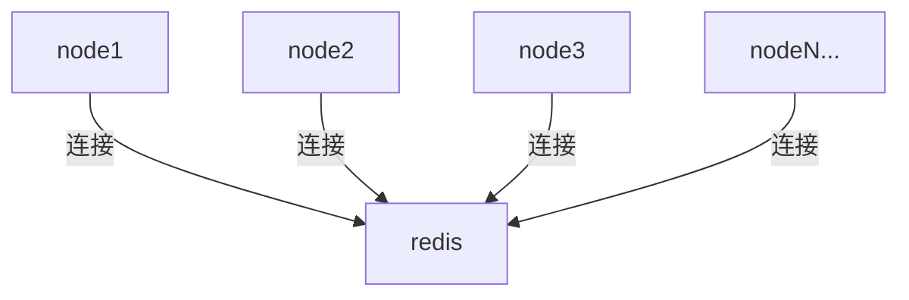
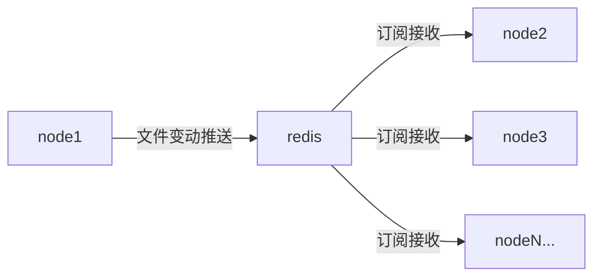

# filesync v3
基于redis消息队列的文件同步工具v3

## 同步流程

多个需要同步的节点（程序），都连到同一个redis示例（或集群）

任意一个节点监视到自己的文件（夹）变动，根据配置文件<u>**计算相对路径**</u>后推送变动信息到redis

相同订阅的其它节点接收到变动信息，将相对路径根据配置文件再转换为绝对路径，同步到自己的本地

这个过程中因为所有节点都是同一个订阅`file_changes`，最初文件信息变动的节点Publish了消息之后，自己同样会接收到消息

针对这种情况引入了NodeInfo的概念（目前它的eccPrivateKey还没有用上，主要是利用公钥为每个节点生成独立的唯一id）

每个节点Publish的时候增加一个PublishFrom参数来标识消息来自哪个节点，订阅处理函数再过滤掉每个节点自己Publish的消息

